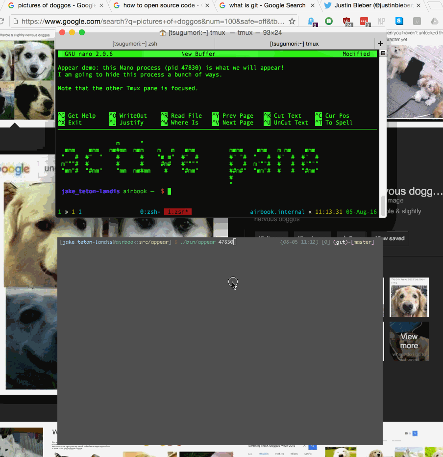

# Appear

Appear your terminal programs in your gui!

[](https://github.com/airbnb/appear) [](http://travis-ci.org/airbnb/appear) [](https://badge.fury.io/rb/appear)

Docs: [current gem](http://www.rubydoc.info/gems/appear), [github master](http://www.rubydoc.info/github/airbnb/appear/master), your branch: `bundle exec rake doc`

[](https://github.com/airbnb/appear/raw/master/screenshot.gif)
<!-- the above screenshot is purposefully broken for YARD docs: it's annoying
     there, but nice on github :) -->

Appear is a tool for revealing a given process in your terminal. Given a
process ID, `appear` finds the terminal emulator view (be it a window, tab, or
pane) containing that process and shows it to you. Appear understands terminal
multiplexers like `tmux`, so if your target process is in a multiplexer
session, `appear` will reveal a client connected to that session, or start one
if needed.

This project intends to support all POSIX operating systems eventually, but
currently only supports macOS.

## usage

```
Usage: appear [OPTION]... [PID]
Appear PID in your user interface.
Appear will use the current process PID by default.

Options:
    -l, --log-file [PATH]            log to a file
    -v, --verbose                    tell many tales about how the appear process is going
        --record-runs                record every executed command as a JSON file in the appear spec folder
        --version                    show version information, then exit
    -?, -h, --help                   show this help, then exit

Exit status:
  0  if successfully revealed something,
  1  if an exception occured,
  2  if there were no errors, but nothing was revealed.
```

## supported terminal emulators

macOS:

 - iTerm2
 - Terminal

cross-platform:

 - tmux

GNU Screen support is a non-goal. It's time for screen users to switch to tmux.

## system requirements

 - `ruby` >= 2
 - `lsof` command
 - `ps` command
 - `pgrep` command
 - if you're a mac, then you should have macOS >= 10.10

Appear depends only on the Ruby standard library.

## how it works

Here's how Appear works in a nutshell, given a `target_pid`

1. get all the parent processes of `target_pid`, up to pid1. We end up with a
   list of ProcessInfos, which have fields `{pid, parent_pid, command, name}`
2. go through our list of "revealers", one for each terminal emulator (tmux,
   iterm2, terminal.app) and ask the revealer if it can apply itself to the
   process tree.
3. if a revealer finds an associated process in the tree (eg, tmux revealer
finds the tmux server process), it performs its reveal action
  - this usually involves invoking `lsof` on a `/dev/ttys*` device to see what
    processes are talking on what ttys to each other, which takes a bunch of
    time
  - `lsof` in Appear is parallel, so grouped lsof calls are less expensive
  - the Tmux revealer is smart enough to both focus the pane that the
    `target_pid` is running in, AND to recurse the revealing process with the
    tmux client id, to reveal the tmux client.
4. the revealer sends some instructions to the terminal emulator that contains
the view for the PID
  - for our Mac apps, this involves a helper process using [Javascript for
    Automation][jfora], a JavaScript x Applescript crossover episode.
  - for tmux this is just some shell commands, super easy.

[jfora]: https://developer.apple.com/library/mac/releasenotes/InterapplicationCommunication/RN-JavaScriptForAutomation/Articles/OSX10-10.html#//apple_ref/doc/uid/TP40014508-CH109-SW1

## ruby api

The method documented here is the only part of Appear that should be considered
stable.

```ruby
require 'appear'

# super simple
Appear.appear(pid)

# You may customize logging, if needed, using the Config class
config = Appear::Config.new

# print debug info to STDOUT
config.silent = false
# also write to a log file
config.log_file = '/tmp/my-app-appear.log'

Appear.appear(pid, config)
```

## contributing

First, get yourself set up:

1. make sure you have bundler. `gem install bundler`
2. inside a git clone of the project, run `./scripts/setup` or `bundle install`

Then, submit PRs from feature branches for review:

1. `git checkout -b my-name--my-branch-topic`
1. write code
1. run `./scripts/console` for a nice pry session with an instance ready to go
1. run `bundle exec rake` to run tests and doc coverage
1. commit and push your changes, however you do
1. [open a PR against airbnb master](https://github.com/airbnb/appear/compare?expand=1)
